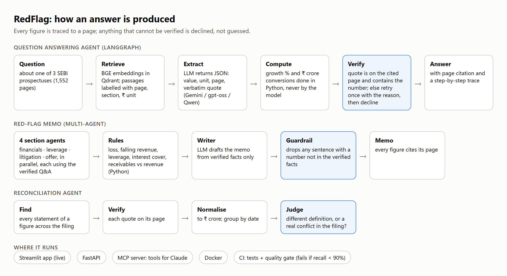
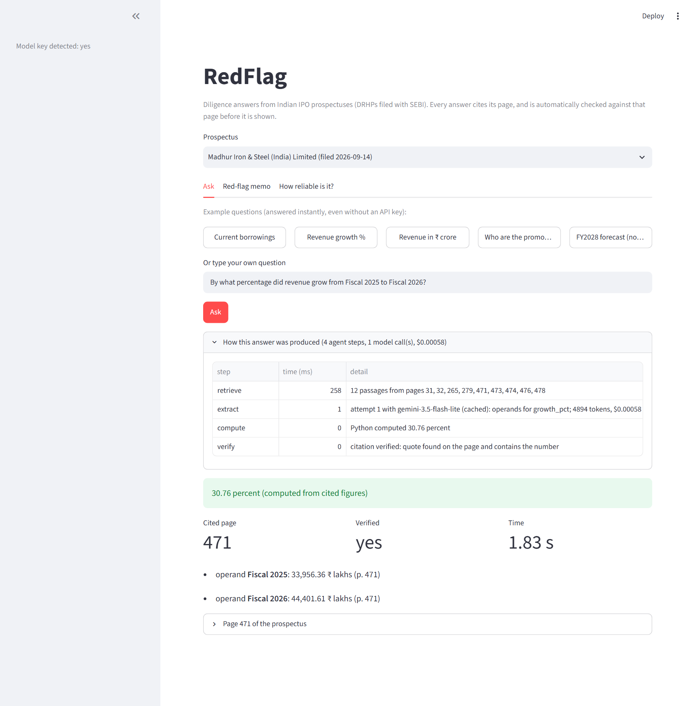
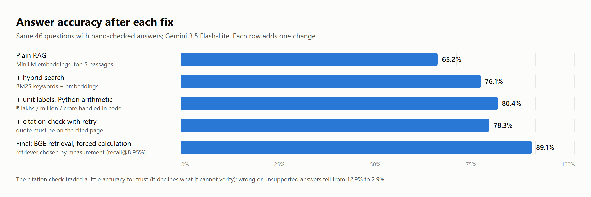
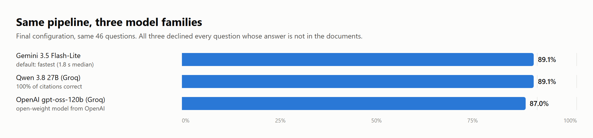

# RedFlag

**Live demo: https://redflag1.streamlit.app** · usable from Claude Desktop via MCP ([setup](docs/claude_desktop.md))

Diligence answers and red-flag memos from Indian IPO prospectuses, where **every answer cites its page and is
checked against that page before it is shown**, and the system declines rather than guesses.

**Data:** three real Draft Red Herring Prospectuses filed with SEBI in August-September 2026: Atomberg Technologies
(consumer appliances), Madhur Iron & Steel (steel), Anchor Offshore Services (marine services). 1,552 pages,
5,359 passages.





## Results (46 questions with known answers)

The test set covers numbers inside tables, facts in text, growth calculations, unit conversions (lakhs / million /
crore), and questions whose answer is not in the document.

| Setup | Accuracy | Wrong or unsupported answers | Declined correctly |
|---|---|---|---|
| Plain RAG (MiniLM embeddings, top-5) | 65.2% | 12.9% | 3/3 |
| + hybrid search (BM25 + embeddings) | 76.1% | 5.9% | 3/3 |
| + unit labels + Python arithmetic | 80.4% | 2.9% | 3/3 |
| + citation verification with retry (v1) | 78.3% | 2.9% | 3/3 |
| **Final: BGE retrieval + forced calculation** | **89.1%** | 5.0% | 3/3 |

**Models** (final setup, same 46 questions, one model-agnostic code path):

| Model | Accuracy | Citations correct | Wrong or unsupported | Declined correctly | Median time |
|---|---|---|---|---|---|
| Gemini 3.5 Flash-Lite (default) | 89.1% | 95.0% | 5.0% | 3/3 | 1.8 s |
| OpenAI gpt-oss-120b (via Groq) | 87.0% | 94.9% | 7.7% | 3/3 | 21.9 s* |
| Qwen 3.8 27B (via Groq) | 89.1% | **100%** | **2.6%** | 3/3 | 20.9 s* |

\*Mostly waiting on Groq's free-tier tokens-per-minute limit, not model speed. Cost per answer is under $0.0011 for
all three at list prices. The reliability pipeline carries across model families: all three land at 87-89% and decline
every question the documents cannot answer. Gemini stays the default for speed; Qwen is the most conservative
(no wrong citations). Claude is wired in but not benchmarked (no key).

**Expanded test set (94 questions).** I then doubled the test set with 48 harder questions, mostly balance-sheet
line items from different years. The final setup scored **84.0%** (wrong or unsupported answers 5.3%; all 6
not-in-the-document questions declined). Most misses are cautious "not found" answers on table rows. Retrieving
12 passages instead of 8 raised accuracy from 80.9%; a popular fix, contextual chunk headers, made retrieval worse
and was reverted ([failure catalogue](docs/failure_catalogue.md), F11).





**Retrieval** (does the right passage reach the model? recall@8): BM25 72% · MiniLM 86% · BM25+MiniLM 86% ·
BM25+BGE 88% · **BGE-small 95%**. I expected hybrid to win; it didn't on these documents, so the final setup uses BGE.

**What it found in the filings**
- **Anchor Offshore:** trade receivables up 71.8% while revenue fell 24.4%.
- **Atomberg:** restated loss of ₹148.88 crore in FY2026, inventories doubled while revenue grew 35%, and claims against the company equal to 203% of equity.
- **Madhur Steel:** trade receivables up 92% while revenue grew 31%; borrowings 1.65x equity.
- **Madhur Steel (filing issue):** its summary table labels ₹9,123.93 lakh (about ₹91 crore) of **unsecured** loans as secured (p. 424 vs p. 438-440). Found while checking answers, not by the AI.

**What I caught the AI getting wrong** is in [docs/pow/01_memo_review.md](docs/pow/01_memo_review.md), and every failure
type with its fix is in [docs/failure_catalogue.md](docs/failure_catalogue.md).

## Reconciliation agent (in progress)

Checks whether a filing agrees with itself: finds every statement of a key figure, verifies each quote on its page,
normalises units, and judges each disagreement as a different definition (fine) or a real conflict; an arithmetic
check flags any "secured" total that equals secured + unsecured parts.

| Filing | Known issue (found by hand) | Result so far |
|---|---|---|
| Atomberg | none | 0 conflicts raised across 72 revenue comparisons (correct: no false alarms) |
| Madhur Iron & Steel | ₹9,123.93 lakh unsecured loans labelled "secured" | First run: **missed it**. The page with the unsecured sub-total was cut from the model's context, so it only saw consistent totals (and correctly raised 0 false alarms on 54 revenue/equity comparisons). Fix: targeted sub-total queries + the arithmetic check; re-run pending (free-tier quota) |
| Anchor Offshore | 50 vs 53 tax cases | Pending (free-tier quota) |

## How it works

```
question ─> retrieve (BGE, Qdrant) ─> extract (LLM, JSON: value, unit, page, quote)
                                        │ growth / conversion? ─> operands only ─> Python computes
                                        ▼
                                  verify: quote on the cited page? number in the quote?
                                        │ no ─> retry once with the reason ─> still no ─> decline
                                        ▼
                                  answer with page citation

memo:  financials ┐
       leverage   ├─(parallel agents, each using the verified Q&A)─> red-flag rules (Python) ─> writer (LLM)
       litigation │                                                     ─> guardrail: drop any sentence with
       offer      ┘                                                        a number not in the verified facts
```

- **LangGraph** for both agents, **LangChain** BM25 retriever, **LlamaIndex** chunking with page, unit and section metadata,
  **Qdrant** vector store, **fastembed** local embeddings (MiniLM, BGE-small), **LiteLLM** so any model works
  (Gemini, OpenAI gpt-oss and Qwen benchmarked; Claude wired in, used when its key is set).
- **Data stores:** a relational **answer log on PostgreSQL or MySQL** (SQLAlchemy; every answer with verification,
  page, model, latency and cost, and per-document reporting in SQL), a **MongoDB** human-review queue for unverified
  answers (corrections become new test questions), and memo storage on **AWS S3** (encrypted, presigned links).
  CI runs PostgreSQL and MySQL service containers.
- **FastAPI** (`/ask`, `/memo`, `/feedback`, `/reviews`, `/answers/report`), **Streamlit** app, **Docker** image, **GitHub Actions** CI that builds the
  image and checks the running API.
- Reliability: pydantic-validated JSON with a repair retry, rate-limit back-off, a disk cache (re-running an
  evaluation costs nothing), per-answer latency, tokens and cost.

## Run

```bash
pip install -r requirements.txt            # Python 3.12
python -m redflag.setup                    # downloads the 3 DRHPs from SEBI, builds passages and the MiniLM index
python -m redflag.index bge                # BGE index (the one the final setup uses)
python -m redflag.qa madhur_steel "What were current borrowings as at March 31, 2026?"
python -m redflag.memo anchor_offshore     # red-flag memo -> reports/memo_anchor_offshore.md
python -m evals.run naive hybrid units_compute full_v1 full
python -m evals.retrieval
uvicorn redflag.api:app --port 8900
streamlit run app/streamlit_app.py
pytest                                     # 11 offline tests (no API key needed)
```

Set `GEMINI_API_KEY` in `.env` (optionally `ANTHROPIC_API_KEY` / `OPENAI_API_KEY`).

## Honest limits
- 46 questions across 3 documents is a small test set; each wrong answer moves accuracy by about 2 points.
- Three model families were benchmarked (Gemini, OpenAI gpt-oss, Qwen); Claude is supported but not benchmarked (no key).
- A correct citation does not guarantee the right meaning: the AI mixed definitions ("borrowings" in three tables) and
  confused litigation *by* vs *against* the company. Reconciliation checks and human review of the memo remain necessary.
- Not investment advice; the memos are a first pass for an analyst.

Proof-of-work documents for the Binocs Forward Deployed Engineer role are in [docs/pow/](docs/pow/).
